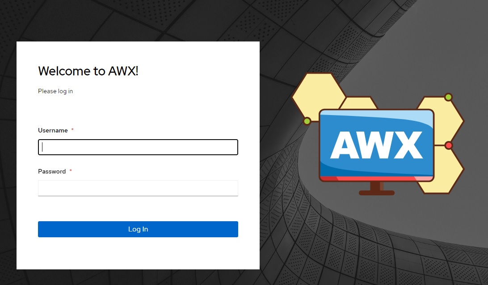
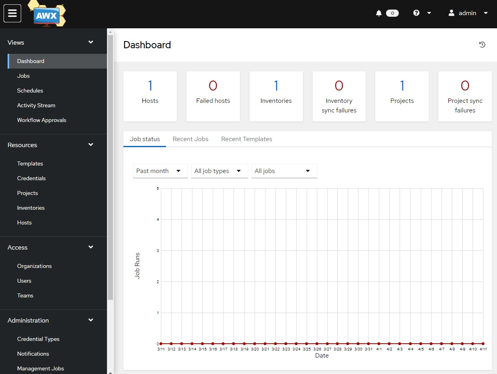

### Kubernetes (Kind) + Ansible AWX-Operator

## Installation Proccess

### 1- Kubernetes

1.1 We will use Kind to install Kubernetes. 

"kind is a tool for running local Kubernetes clusters using Docker container "nodes". kind was primarily designed for testing Kubernetes itself, but may be used for local development or CI."

Check complete documentation and the steps to install it. ( SUPER EASY ☺️ ) [here](https://github.com/kubernetes-sigs/kind)

- 1.2 - Configure our nodes:

    - 1.2.1 - (Optional) Change you cluster configuration [here](./cluster-config/config.yaml) 
        ```
        kind: Cluster
        apiVersion: kind.x-k8s.io/v1alpha4

        nodes:
        - role: control-plane
        - role: worker
        - role: worker
        ```

    - 1.2.2 - Create a Cluster

        ```
        kind create cluster --config=./cluster-config/config.yaml

        ```

    

### 2- Kustomize

 - 2.1 Install Kustomize

    "Kustomize provides a solution for customizing Kubernetes resource configuration free from templates and DSLs."

    Check the installation proccess here. [here](https://kubectl.docs.kubernetes.io/installation/kustomize/)


### 3- Ansible AWX-Operator

- 3.1 Install AWX 
    
    - 3.1.1 Execute the command below

        ```
        kustomize build ./awx/step1/ | kubectl apply -f -
        ``` 

    - 3.1.2 Set the context 

        ```
        kubectl config set-context --current --namespace=awx
        ```
    
    - 3.1.3 Expected result  

        Execute:
        ```
        kubectl get pods
        ```
        Expected:
        
        ```
        NAME                                               READY   STATUS    RESTARTS   AGE
        awx-operator-controller-manager-86dc5b757b-bptqw   2/2     Running   0          117s
        ```


    - 3.1.4 Execute the command below and wait some minutes to create new pods

        ```
        kustomize build ./awx/step2/ | kubectl apply -f -
        ```  

    - 3.1.5 Expected result  

        Execute:
        ```
        kubectl get pods
        ```
        Expected:
        
        ```
        NAME                                               READY   STATUS    RESTARTS   AGE
        awx-demo-766fffc8c8-pjd24                          4/4     Running   0          84s
        awx-demo-postgres-0                                1/1     Running   0          2m15s
        awx-operator-controller-manager-86dc5b757b-bptqw   2/2     Running   0          7m50s
        ```


### 4- AWX Access

- 4.1 Get AWX password
    
    ```
    kubectl get secret awx-demo-admin-password -o jsonpath="{.data.password}" | base64 --decode
    ```
- 4.2 Port forward
    ```
    kubectl port-forward deployment/awx-demo 9456:8052
    ```
### 4- Screens


